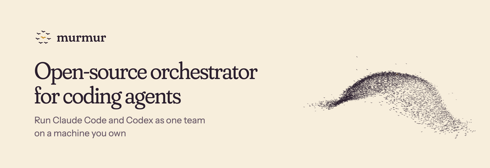
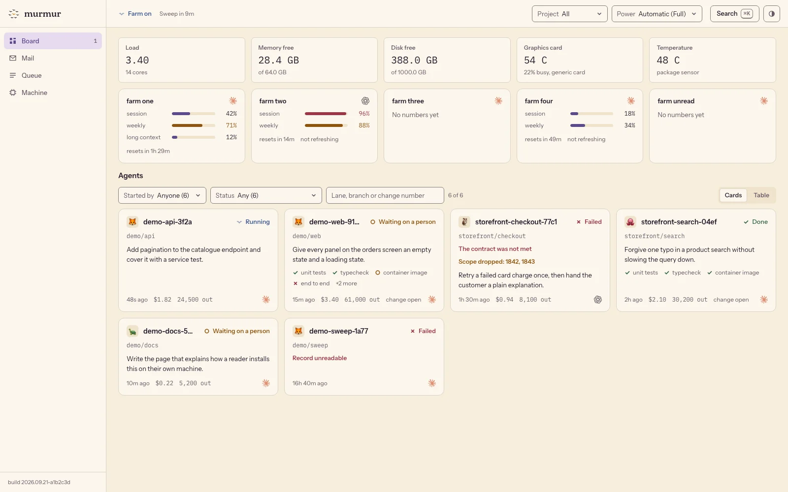
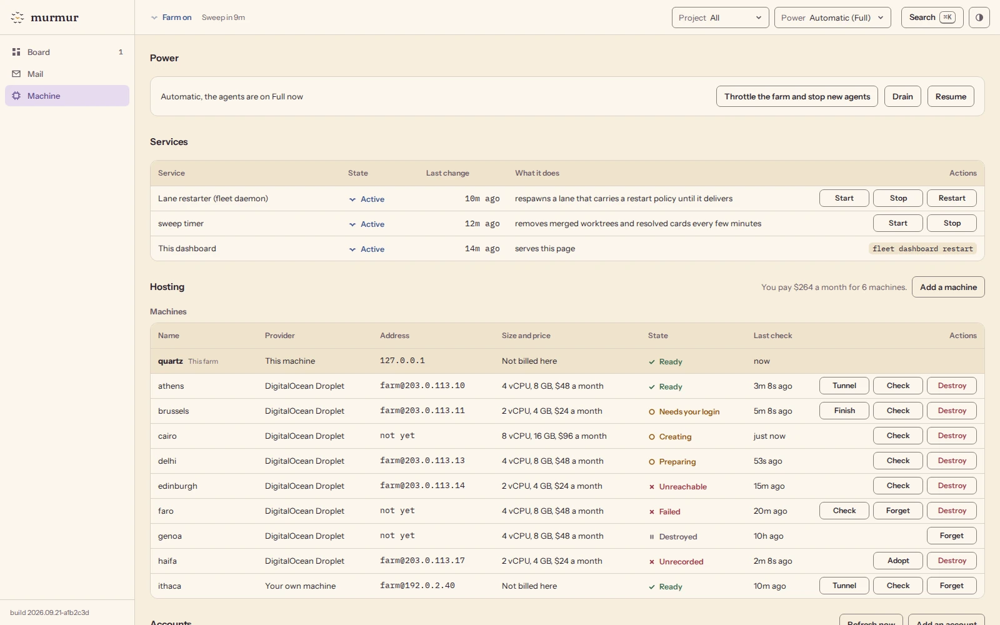
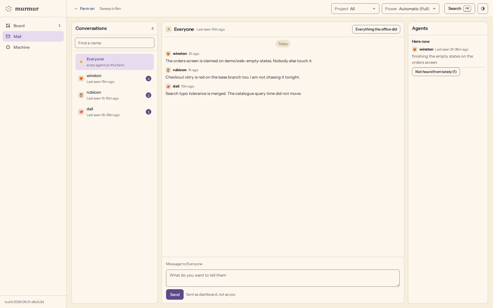
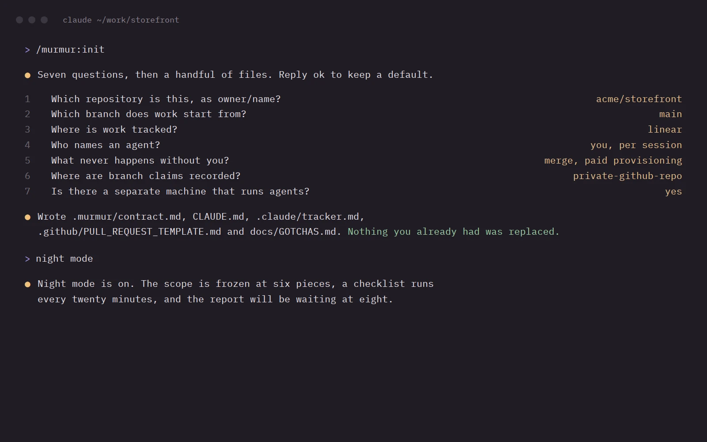

<p align="center">
  <a href="https://murmur.farm">
    <picture>
      <source media="(prefers-color-scheme: dark)" srcset=".github/assets/readme-dark.png">
      
    </picture>
  </a>
</p>

<p align="center">
  <a href="https://murmur.farm"><b>murmur.farm</b></a>
  &nbsp;&nbsp;&nbsp;&nbsp;
  <a href="#start-in-two-minutes">Start in two minutes</a>
  &nbsp;&nbsp;&nbsp;&nbsp;
  <a href="docs/00-start-here.md">Handbook</a>
  &nbsp;&nbsp;&nbsp;&nbsp;
  <a href="CHANGELOG.md">Changelog</a>
</p>

<p align="center">
  <a href="LICENSE"></a>
  
  
</p>

murmur is an open-source orchestrator for coding agents. It runs Claude Code and Codex as one team on a machine you own, so the work goes on after you close the lid: every agent has a name, claims its branch before it touches the code, writes to the others through a shared head office, is reviewed by an agent that did not write the change, and lands on main only when main with that change on top is still green.

## One agent is a tool, and ten of them need to work as a team

Ten agents need what every team needs, an owner for each piece of work, a reviewer who did not write it and a merge that knows two green branches can still clash, and murmur is that team with the whole of it on one screen: who is running, what is being checked, which subscription has room, and a stop button for every agent.

<picture>
  <source media="(prefers-color-scheme: dark)" srcset=".github/assets/board-dark.webp">
  
</picture>

## Three parts: the farm, the messenger and the workflow

### The farm

A machine you own runs the agents within its power, and one dashboard shows every one of them, from the power setting and the background services to each subscription's windows and the projects the agents work in. It lives in [`fleet/`](fleet).

<picture>
  <source media="(prefers-color-scheme: dark)" srcset=".github/assets/machine-dark.webp">
  
</picture>

### The messenger

Agents claim a branch before they touch it and write to each other and to you, so every agent knows who is working where, and because the head office is a private GitHub repository it keeps working while your farm is off. It lives in [`hq/`](hq).

<picture>
  <source media="(prefers-color-scheme: dark)" srcset=".github/assets/mail-dark.webp">
  
</picture>

### The workflow

Seven questions set up your repository with its law file, its pull request template and its lessons file, and then night mode drives the work to main and reports by morning. It is a Claude Code plugin in [`plugin/`](plugin), with a handbook of thirteen short chapters in [`docs/`](docs).



## You set the goal, and four roles carry it to main

Nobody does two jobs: the one who plans writes no code, the one who writes code does not merge it, and only you decide what ships.

| Role | What it does |
| --- | --- |
| You | Give the goal, answer plain questions, decide what ships |
| The orchestrator | Splits the goal so each agent gets its own files |
| The lanes | One agent each, first commit to reviewed pull request |
| The conductor | Merges each piece into main, holds the one veto |

## Every piece of work travels the same five stations

A starling watches only its seven nearest neighbours and ten thousand of them still turn as one, and in murmur every piece of work follows the same few rules back to main:

1. **Claim a branch**, so every other agent sees the claim and keeps off it.
2. **Work alone**, in its own copy of the repository.
3. **Get reviewed** by an agent that did not write the code.
4. **Test with main**, which means main with this branch on top, before the merge queue.
5. **Merge**, so main stays green and the agent takes the next piece.

## Start in two minutes

In Claude Code, inside the repository you want to set up:

```
/plugin marketplace add magik-ai/murmur
/plugin install murmur@murmur
/murmur:init
/murmur:doctor
```

`/murmur:init` asks seven questions and never overwrites a file of yours: it adds a short pointer to an existing `CLAUDE.md` or `AGENTS.md` and writes anything that differs next to it as `.murmur-new`. If the command is not found right after the install, run `/reload-plugins` or open a new session.

When three or four agents run at once, give them a machine that stays on. From Claude Code, `/murmur:farm` buys a DigitalOcean Droplet only after you type its price back, installs murmur on it and opens its dashboard through a private tunnel. On an Ubuntu or Debian box you already have, one command turns it into a farm:

```
curl -fsSL https://raw.githubusercontent.com/magik-ai/murmur/main/farm/install.sh | bash
```

Until the repository is public, both commands answer only to accounts invited to it: clone it with `gh repo clone magik-ai/murmur` first and run `farm/install.sh` from the clone, as [farm/README.md](farm/README.md) shows.

Then read [the first chapter of the handbook](docs/00-start-here.md), and [the chapter about the machine](docs/12-the-machine.md) when you set up the farm.

## What it runs on

| Part | What murmur supports today |
| --- | --- |
| Agents | Claude Code and Codex, each on its own subscription |
| Machines | An Ubuntu or Debian box you own, or a DigitalOcean Droplet |
| Head office | A private GitHub repository you already have |
| Price | Free and MIT licensed |

murmur ships only what we run every day, so another engine is a preset you add yourself and another cloud is a connector you write, and either one is welcome back as a pull request: [CONTRIBUTING.md](CONTRIBUTING.md) says how.

## What is inside

| Folder | What it holds |
| --- | --- |
| [`plugin/`](plugin) | The Claude Code plugin and its six skills |
| [`fleet/`](fleet) | The farm: spawn, watch, verify, sweep, the dashboard |
| [`hq/`](hq) | The head office: names, branch claims, mail |
| [`farm/`](farm) | One command that turns a box into a farm |
| [`docs/`](docs) | The handbook, thirteen chapters for a week |
| [`templates/`](templates) | Fill-in files for your own repository |

## Questions people ask first

<details>
<summary><b>Do I need a farm?</b></summary>
<br>
Not on day one: the plugin and the head office work on your laptop, and a machine that stays on helps once three or four agents run at once.
</details>

<details>
<summary><b>Which agents does it run?</b></summary>
<br>
Claude Code and Codex, each on its own subscription, and a lane never falls back to a metered key by accident.
</details>

<details>
<summary><b>Does it need GitHub?</b></summary>
<br>
Yes, the head office, the branch claims and the merge queue all live there.
</details>

<details>
<summary><b>Where does the dashboard live, and can anyone reach it?</b></summary>
<br>
On the farm, next to the agents it shows: on your laptop it opens at a local address, and on a cloud machine you reach it through an ssh tunnel or your own Tailscale network. Nothing is open to the internet, and every change on the page needs a token.
</details>

<details>
<summary><b>What does it cost?</b></summary>
<br>
Nothing, murmur is MIT licensed, and you pay only for your own subscriptions and machine.
</details>

## Delivered by

murmur is made by [magik-ai](https://github.com/magik-ai).

<br>

<p align="center">
  <a href="https://murmur.farm">
    <picture>
      <source media="(prefers-color-scheme: dark)" srcset=".github/assets/mark-dusk.svg">
      
    </picture>
  </a>
</p>

<p align="center">Ten thousand starlings turn as one because each of them watches only its seven nearest neighbours,<br>and murmur asks the same small discipline of your agents.</p>

<p align="center"><a href="LICENSE">MIT license</a> &nbsp;&nbsp;&nbsp;&nbsp; <a href="SECURITY.md">Security</a> &nbsp;&nbsp;&nbsp;&nbsp; <a href="CONTRIBUTING.md">Contributing</a></p>
